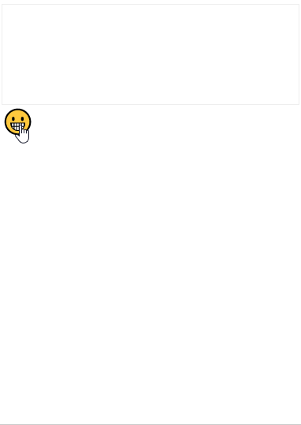

# emoji-picker-vue
## demo


[online](https://i9neq.codesandbox.io/)

[codesandbox](https://codesandbox.io/embed/new-butterfly-i9neq)
## In node

    npm install emoji-picker-vue | yarn add emoji-picker-vue
```js
import Vue from 'vue';
import emojiPicker from './dist/emoji-picker-vue.min.js';
import 'emoji-picker-vue.min.css';
```
## In browser
```html
<head>
    <link rel="stylesheet" href="emoji-picker-vue.min.css"/>
</head>
<body>
    <script src="vue.min.js"></script>
    <script src="emoji-picker-vue.js"></script>
</body>
```

## config

Prop | Type | Default | Description
-|-|-|-
target | HTMLInputElement | @required | element to be put emoji
show | Boolean | @required | control the display of emoji
config | Object | @optional | config the style of emoji
config.width | String | 288px | width of emoji
config.height | String | 180px | height of emoji

## custom
- custom your own emoji or add more emoji, you should edit  `src/components/codepoints.js`, then run `npm run release`, finally, new `emoji-picker-vue.min.js` will be generated in `dist/`, emoji codepoint can be found in [unicode.org/emoji](https://unicode.org/emoji/charts/emoji-list.html)

- custom theme, you should edit  `src/components/index.styl`, then run `npm run release`, finally, new `emoji-picker-vue.min.css` will be generated in `dist/`